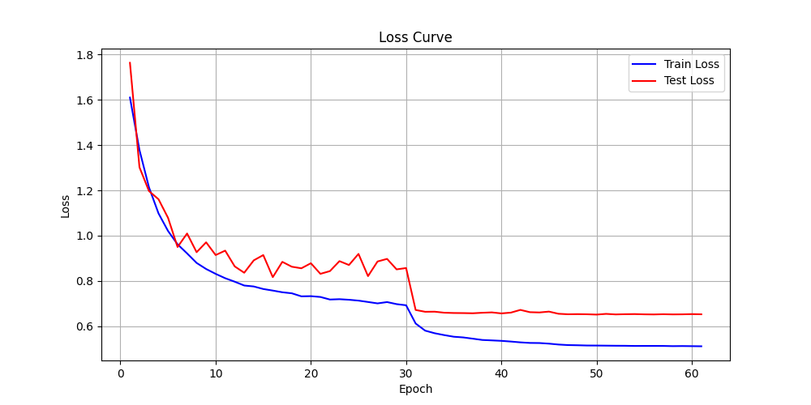
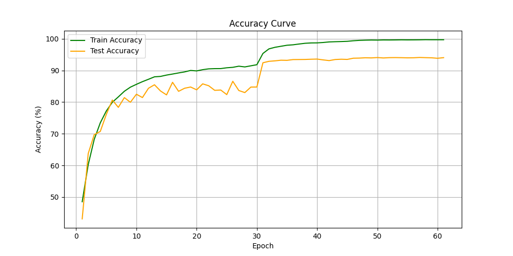

# ResNet CIFAR-10 Training Project

This repository contains a PyTorch implementation of ResNet for image classification on the CIFAR-10 dataset. It includes data loading, model definition, training, evaluation, and visualization scripts, along with unit tests for key components.

## Final Model Performance

- **Best Test Accuracy**: **94.11%**
- **Best Test Loss**: ~0.652
- **Best Epoch**: 57
- Trained using **ResNet-18**, SGD optimizer with momentum and weight decay, and MultiStepLR scheduler.

## Project Structure

```
main.py                  # Entry point for training and evaluation
model/
  resnet.py              # ResNet model definition
train/
  trainer.py             # Training loop and evaluation
visualize/
  plots.py               # Visualization code
plots/
  accuracy_curve.png     # Saved accuracy plot
  loss_curve.png         # Saved loss plot
data/
  dataloader.py          # Data loading and augmentation
  datasets/              # CIFAR-10 dataset files
model_save/
  best_model.pth         # Saved best model
  final_model.pth        # Saved final model

# Tests
tests/
  test_dataloader.py     # Test for dataloader
  test_model.py          # Test for model output
  test_training.py       # Test for training loop
```

## Setup

1. **Clone the repository:**
   ```bash
   git clone https://github.com/SiddhantGahankari/resnet-cifar10.git
   cd Resnet
   ```

2. **Install dependencies:**
   ```bash
   pip install -r requirements.txt
   ```
   Required packages include:
   - torch
   - torchvision
   - matplotlib
   - tqdm
   - pytest

3. **Download CIFAR-10 dataset:**
   The dataset will be automatically downloaded to `data/datasets/` when running the code.

## Usage

- **Train and evaluate the model:**
  ```bash
  python main.py
  ```
  This will train ResNet-18 on CIFAR-10 and save the final model to `model_save/final_model.pth`.

- **Run tests:**
  ```bash
  pytest tests/
  ```
  All tests should pass successfully. Example output:
  ```
  tests/test_dataloader.py .
  tests/test_model.py .
  tests/test_training.py .
  
  ================================ 3 passed in 98.94s (0:01:38) ================================
  ```

- **Visualize results:**
  Training and test loss/accuracy curves will be displayed after training. The plots are also saved as PNG files in the `plots/` directory:
  - 
  - 

## Customization
- Change model architecture in `model/resnet.py`.
- Adjust training parameters in `train/trainer.py` or `main.py`.
- Modify data augmentation in `data/dataloader.py`.

## License
This project is licensed under the MIT License.
